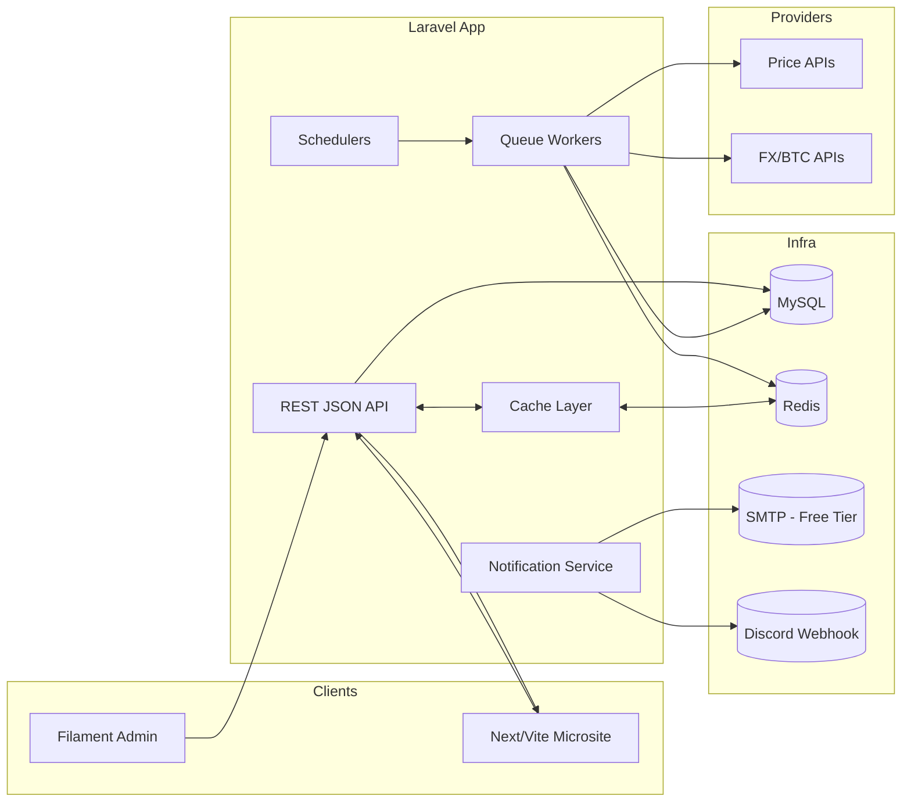

# Copilot Instructions

# Video Game & Console Price Comparison — **Instructions**

**Goal:** Build a portfolio‑grade Laravel application that compares global video‑game/console prices, normalizes values to **BTC**, and presents **pro charts & maps**. Prioritize async architecture, performance, testability, and clean docs. This repo is designed to impress Larajobs recruiters and sustain long‑term maintainability.

---
## 1) Tech Stack & Principles

- **Framework:** Laravel (latest)
- **Admin & API:** Filament (admin UI + policies) + JSON API controllers
- **Front‑end (public microsite):** Next/Vite app **built and served by Laravel** on the same domain (**CSR**)
- **Data & Infra:** MySQL, Redis (cache + queues), Horizon (queue ops), Telescope (local observability)
- **Charts:** ApexCharts via **Larapex** (admin)
- **Maps:** Leaflet + OpenStreetMap (microsite)
- **Testing & Quality:** Pest + PHPUnit, Larastan (PHPStan lvl 8), Laravel Pint
- **Node runtime:** v22.17
- **Architecture choice:** **Pre‑Aggregated‑First** for chart payloads & maps
- **Engineering rules:** SOLID, DRY, small services, dependency injection, clear interfaces, idempotent jobs

---
## 2) Setup

### 2.1 Prerequisites
- PHP ≥ Laravel’s current requirement, Composer
- Node **v22.17** + PNPM or NPM
- MySQL 8+, Redis 6+

### 2.2 Install
```bash
# Backend
composer create-project laravel/laravel game-price-compare
cd game-price-compare
composer require filament/filament laravel/horizon laravel/telescope asvae/larapex-charts

# Frontend (microsite inside /microsite)
mkdir microsite && cd microsite
npm create vite@latest microsite -- --template react-ts
cd microsite && npm i && npm i leaflet
# build will emit to ../public/microsite
```

### 2.3 Env
Create `.env` (values are examples):
```dotenv
APP_ENV=local
APP_URL=https://example.test

# Video Game & Console Price Comparison — Copilot Guide

Purpose: design-first Laravel 10 + Filament app that ingests free provider data, normalizes all prices to BTC, and showcases charts/maps for a remote-ready portfolio project.

## Architecture Snapshot


## Data Model & Normalization
- `products(id, name, platform, slug)` PK `id`; slug unique.
- `sku_regions(id, product_id, region_code, retailer, currency)` FK `(product_id)`; unique `(product_id, region_code, retailer)`.
- `region_prices(id, sku_region_id, recorded_at, fiat_amount, btc_value, tax_inclusive)` index `(sku_region_id, recorded_at)`; store fiat + btc snapshot together.
- `exchange_rates(id, base_currency, quote_currency, rate, fetched_at)` index `(base_currency, quote_currency, fetched_at)`; latest rate via descending index.
- `tax_profiles(id, region_code, vat_rate, notes)` index `(region_code)`; `regions` reference.
- `alerts(id, user_id, product_id, region_code, threshold_btc, channel, active)` index `(product_id, region_code, active)`.
- `users(id, name, email, discord_id, timezone)` email unique.
- `dataset_snapshots(id, kind, started_at, finished_at, row_count, status)` index `(kind, started_at)`.
- Normalization: convert provider fiat using nearest `exchange_rates` when ingesting; persist both fiat and btc columns; set `tax_inclusive` flag based on provider metadata and `tax_profiles`.

## Queues & Scheduler
- Cron via `schedule:work`: hourly `FetchPricesJob`, hourly `FetchFxJob`, hourly `BuildAggregatesJob`, hourly `AnalyzePriceDropsJob`, on-demand `SendAlertJob`.
- Idempotency keys: `fetch:{provider}:{product}:{region}:{timestamp}`, `fx:{base}:{quote}:{fetched_at}`, `series:{product}:{region}:{bucket}:{day|hour}:{tax}`.
- Retry policy: exponential backoff (2^attempt * 30s) + ±15s jitter; max 5 attempts then flag in `dataset_snapshots`.
- Horizon queues: `fetch` (concurrency 2), `fx` (1), `aggregate` (4), `analyze` (2), `notify` (2); balance to keep ingest <2 min.

## Notification Flows
- Alert detection enqueues `SendAlertJob` with idempotency key `alert:{alert_id}:{region_price_id}`.
- Discord: POST JSON payload via webhook; log response + status to `notifications` table.
- Email: queued via free SMTP (e.g., Gmail) using `Mail::to()->queue`; mark delivery attempt in log table with retries.
- Store delivery logs (status, payload hash, provider message) to avoid duplicates and support audit.

## Caching & TTL Plan
- Redis keys: `series:{product}:{bucket}:{regions_hash}:{from}:{to}:{tax}` TTL 20m; `map:{product}:{stat}:{window}:{tax}` TTL 30m; `geo:countries` TTL 24h; `fx:latest:{base}:{quote}` TTL 60m.
- Use atomic `setnx` locks (`lock:series:...`) around cache primers to prevent stampede; release after populate.
- Bypass cache when `?nocache=1` header flag for admin debugging only.

## Visualization Spec
- **ApexCharts (via Larapex):** BTC-normalized time series (per region), price-drop waterfall per region, product comparison multi-line; accessible palette (WCAG AA), responsive legends/tooltips; enable CSV & PNG export; target p95 render <1.2s on mid-tier mobile.
- **Leaflet Microsite:** World choropleth of effective BTC price, retailer markers when available, hover tooltips (`region`, BTC + converted fiat, last updated); store GeoJSON in `storage/app/geo/countries.json` cached via Redis; default `EPSG:3857` projection, disable scroll zoom on load for mobile.

## Microsite API Design
- Read-only JSON; CORS for microsite origin; bearer or query token for non-public endpoints.
- Endpoints: `/api/products?search=&page[cursor]=...&per_page=20`, `/api/compare` (params: `product_id`, `regions`, `bucket`, `from`, `to`, `include_tax`), `/api/map/choropleth` (params: `product_id`, `stat`, `window`, `include_tax`), `/api/regions`, `/api/geo/countries` (cached GeoJSON).
- Pagination: cursor-based, default `per_page=20`, cap 50.
- Responses include `meta.cache_ttl`, `etag`, and `unit` fields; use `Cache-Control: public, max-age=900` hints.

## Performance & Testing
- KPIs: ingest 10k price points <120s; p95 API latency <300ms with cache hit; microsite first chart render <1.2s, TTI p95 <2.0s; alert delivery <60s from trigger.
- Tests: Pest/PHPUnit units for services, fakes for providers, feature tests for `/api/*`, integration for jobs with Redis + database; performance timers around aggregation services.
- Static/style: Larastan level 8, Laravel Pint (PSR-12) pre-commit.
- CI: GitHub Actions matrix (PHP 8.2 + 8.3) running composer install, Pint, Larastan, Pest, coverage upload.
- Frontend: Lighthouse ≥90 (performance, accessibility); bundle analyze with `vite build --report`.

## Documentation Deliverables
- `README.md`: project pitch, stack, setup (backend + microsite), env vars, run commands, key KPIs, screenshots/gifs, testing instructions.
- `docs/Architecture.md`: high-level diagram (reuse Mermaid), data flow, queue strategy, caching rationale, provider constraints, risk mitigations.
- `docs/StyleGuide.md`: chart palette, typography, spacing, Leaflet theming, accessibility notes.
- Case study: short narrative (problem → constraints → pre-aggregated choice → async queues → visuals) highlighting remote-readiness for Larajobs recruiters.

## Dev Workflow Quick Hits
- PHP ≥ Laravel 10 requirement, Node 22.17, Redis 6+, MySQL 8+.
- Commands: `php artisan migrate`, `php artisan horizon`, `php artisan schedule:work`, `php artisan queue:work --tries=3`, `php artisan test --parallel`, `./vendor/bin/phpstan analyse --level=max`, `./vendor/bin/pint`, `npm --prefix microsite run build`.
- Follow SOLID, DRY, thin controllers → services + DTOs; guard external calls with retries + circuit breaker if needed.
- `price_series_hourly` (future) { id, product_id, region_code, hour, min_btc, max_btc, mean_btc, sample_count, tax_inclusive }

**Alerts & Users**
- `alerts` { id, user_id, product_id, region_code, threshold_btc, channel, active }
- `users` { id, name, email, discord_id }

**Dataset Ops**
- `dataset_snapshots` { id, kind, started_at, finished_at, row_count }

**Normalization Rules**
- On ingest, persist **fiat** and computed **btc_value** simultaneously (fx snapshot at fetch time).
- Series rows carry `tax_inclusive` flag; API toggles via `include_tax=true|false`.

## 3) API (Read‑only Public JSON)
**Compare series**
```
GET /api/compare?product_id=42&regions=US,CA,GB&bucket=day&from=2025-09-25&to=2025-10-24&include_tax=true
→ { product_id, bucket, series:[{region, points:[[YYYY-MM-DD, value]...]}], meta:{from,to,unit:"BTC"} }
```
**Choropleth map**
```
GET /api/map/choropleth?product_id=42&stat=mean_btc&window=30d&include_tax=true
→ { product_id, stat, window, regions:[{ code, value }] }
```
**Aux**
- `GET /api/products?search=&page[cursor]=…&per_page=20`
- `GET /api/regions`
- `GET /api/geo/countries` (GeoJSON; long cache)

**API Notes**
- Cursor pagination for lists; `per_page` capped (≤20)
- CORS enabled; simple token for admin/ops endpoints
- HTTP cache: `ETag` + `Cache-Control: public, max-age=900`

## 4) Pre‑Aggregated vs Raw — Trade‑offs
**Assumptions:** 200 products × 100 regions × 30 days → **600k snapshot rows** (~small). Compare view needs 100 × 30 = **3,000 points**.

**Pre‑Aggregated‑First**
- Server stores daily rollups per product×region: smaller payloads, predictable latency.
- Redis hot keys serve compare/maps in ~5–50 ms server time; JSON ~120–250 KB compressed.
- Minimal client CPU — fast first render (target ≤1.2 s).
- Requires rollup job + cache warming; easiest to test.

**Raw‑First**
- Server ships raw snapshots + fx/tax flags; browser aggregates → more CPU + variability.
- Heavier JSON (200–400 KB) and 150–400 ms extra client compute on mid‑tier devices.
- Harder to cache final series; more client complexity.

**Recommendation:** **Pre‑Aggregated‑First** — meets CSR budgets and showcases backend craftsmanship (queues, Horizon, Redis).

## 5) Background Jobs & Scheduling
**Cadence**
- `FetchPricesJob` hourly per provider
- `FetchFxJob` hourly (BTC + fiat)
- `BuildAggregatesJob` hourly (daily, future hourly)
- `AnalyzePriceDropsJob` hourly (enqueue `SendAlertJob`)
- `SendAlertJob` queued (email/Discord)

**Idempotency Keys**
- Snapshot: `{provider}:{product}:{region}:{recorded_at}`
- Series: `{product}:{region}:{bucket}:{day|hour}:{tax}`

**Retries/Backoff**
- Exponential backoff + jitter; max 3–5 retries; poison queue to DLQ (or tagged failed‑jobs) with alerting.

**Horizon**
- Named queues: `fetch`, `aggregate`, `analyze`, `notify`
- Concurrency tuned per queue; throughput + failure dashboards screenshotted for portfolio.

## 6) Caching & Keys
**Redis Key Scheme**
- `series:{product}:{bucket}:{regions_hash}:{from}:{to}:{tax}` → points array (TTL 15–30m)
- `map:{product}:{stat}:{window}:{tax}` → region values (TTL 15–30m)
- `geo:countries` → GeoJSON (TTL 24h)

**Stampede Protection**
- Use cache locks (`remember` with lock or atomic set‑if‑absent); pre‑warm hot keys after aggregate builds.

**Bypass Rules**
- Bypass cache for admin debug with `?nocache=1` (guarded); always record cache hit/miss in logs.

## 7) Visualization Spec
**ApexCharts (admin)**
- Multi‑region BTC line chart (compare view)
- Price‑drop waterfall per region
- CSV/PNG export; accessible palette; responsive tooltips/legend

**Leaflet (microsite)**
- Choropleth of mean BTC price over 30d
- Optional retailer markers
- Tooltips: region code/name, value in BTC (+ converted fiat via last fx)
- Data: `/api/map/choropleth` + `/api/geo/countries`; join by `region.code`

## 8) Performance & SLOs
**Budgets**
- API p95 ≤ **300 ms** (Redis‑backed reads)
- First chart render ≤ **1.2 s**; TTI p95 ≤ **2.0 s** (mid‑tier mobile)
- Ingest 10k snapshots/hour < **2 min** E2E

**Measurement**
- Server‑Timing headers; Horizon metrics; Lighthouse & Web Vitals in microsite
- Log chart render time + API latency; keep dashboards for screenshots

## 9) Security & Compliance
- Read‑only public API; admin routes guarded by Filament policies
- Rate limiting on `/api/*` (per IP + per token)
- No PII beyond email/discord_id for alerts; scrub logs; env secrets in `.env`

## 10) Testing & CI
- **Pest/PHPUnit**: unit (services), feature (API), integration (jobs), perf (timed tasks)
- **Static**: Larastan lvl 8; **Style**: Pint
- **CI**: GitHub Actions → run tests (parallel), static analysis, style; badges in README
- **Seeders**: demo products/regions; factories for series; screenshot script for charts/maps

## 11) Risks & Mitigations
- **API rate limits** → Redis cache, staggered fetches, backoff+jitter, provider rotation
- **Sparse regions** → fallback to fewer regions; UI indicates unavailable areas
- **FX volatility** → snapshot FX at fetch time; show timestamp in UI tooltips
- **Mobile jank** → pre‑aggregates, downsample long series, throttle map re‑renders

## 12) Roadmap
**MVP**
- Prices/FX ingest → daily aggregates → compare & choropleth APIs → admin charts → Leaflet microsite → alerts → tests/CI/docs

**Next**
- Hourly series for hot products
- Alert rules UI; CSV import/export
- Feature flags; multi‑tenant org support

## 13) Definition of Done (Portfolio‑ready)
- Green CI badges; Lighthouse ≥ 90
- Horizon & chart/map screenshots
- README + Architecture.md complete; seeded demo
- Short demo video showing compa
*This file will be updated once the codebase is populated with project files.*

# 🔧 Combined Codex Command (Plan ➜ Code)

**Paste this into Copilot/Codex Chat.**

> **Role:** Act as my senior systems engineer. First produce a complete, actionable **Plan**. Then, **generate code** scaffolding exactly as specified. Follow all constraints. Be concise and production-grade.
>
> **Context & Tech:**
> • Laravel (latest), PHP 8.2+, MySQL, Redis (cache + queues), Horizon, Telescope (local), Filament (admin + policies), JSON API controllers
> • Charts: ApexCharts via Larapex (admin)
> • Maps: Leaflet + OpenStreetMap (public microsite)
> • Front-end: CSR microsite (Vite/React) **built and served by Laravel (same domain)**
> • Tests: Pest + PHPUnit; Static: Larastan (PHPStan lvl 8), Style: Pint
> • Node: v22.17
> • Goal: **Top 1000 games** page + compare charts, minimal 3rd-party API usage, fast UX, clean docs
> • Vendors: TheGamesDB (TGDB) and/or NEXARDA v3 (feed/offers)
>
> **Non-negotiables:**
>
> 1. **No daily full sync.** Do one-time bootstrap (private key/feed), then **hourly incrementals** + **14-day rolling sweep**.
> 2. **Reads never call vendors.** User endpoints serve from **MySQL → Redis** only.
> 3. **Pre-Aggregated-First**: server builds daily series; client only renders.
> 4. **Quota safety:** Redis token buckets (hour/day), polite retry/backoff/jitter, ETag/If-Modified-Since when supported.
> 5. **Security:** keep private keys server-side only; never in client or repo.
> 6. **Performance budgets:** p95 API ≤ **300 ms**; first chart render ≤ **1.2 s**; p95 TTI ≤ **2.0 s** (mid-tier mobile).
> 7. **Scale assumptions:** 200 products × 100 regions × 30 days (daily only); compare view = 1 product × 100 regions.
>
> ---
>
> ## **PART 1 — PLAN** (no code; bullets; short paragraphs)
>
> **A) Data Sources & Terms**
> • Identify TGDB/NEXARDA endpoints to use (bootstrap vs incremental/updates vs offers/feed).
> • ToS-safe mirroring; attribution if required; keys handling (private vs public).
> • Rating availability: if missing, propose enrichment or proxies; choose Bayesian/Wilson for ranking fairness.
>
> **B) Mirroring Strategy (Minimal Calls)**
> • One-time bootstrap (private key/feed) → idempotent upserts + checkpoint.
> • Hourly incrementals (public key + ETag/Last-Modified).
> • **Rolling sweep** over **14 days**; daily call caps to fit a **6k/day** example limit.
> • Redis token buckets (`day/hour`), circuit breaker on 429/5xx; user-agent & polite delays.
>
> **C) Local Ranking (Top 1000)**
> • Persist fields: title, platform, external_id, `rating_mean`, `rating_count` (if available).
> • Ranking formula (Bayesian/Wilson) with a minimum `rating_count`.
> • Nightly `ComputeTopGamesJob` → materialize `top_games_1000` table + Redis key `top:1000:v1` (and optional per-platform keys).
>
> **D) Pre-Aggregation for Charts**
> • Series tables: `price_series_daily` (BTC-normalized if used), capped to 30 days.
> • Indexes for fast queries; Redis keys for series/map; pre-warm hot keys; **stale-while-revalidate** policy.
>
> **E) API Design (Read-only, Cache-friendly)**
> • `/api/top?limit=1000&platform=…` → Top 1000 (title/slug/platform/score/ids).
> • `/api/compare?product_id=…&regions=…&bucket=day&from=…&to=…&include_tax=true` → pre-aggregated series.
> • `/api/map/choropleth?product_id=…&stat=mean_btc&window=30d&include_tax=true`.
> • ETag + `Cache-Control: public, max-age=900`; 304 on validators; CORS; token for admin.
>
> **F) Jobs & Schedules**
> • `VendorFullSyncJob` (one-time, private key/feed)
> • `VendorIncrementalUpdateJob` (hourly, public key)
> • `RollingSweepJob` (daily; shard catalog over 14 days)
> • `BuildAggregatesJob` (hourly)
> • `ComputeTopGamesJob` (nightly)
> • Idempotency keys; retries with backoff/jitter; Horizon queues/concurrency.
>
> **G) Caching & Coalescing**
> • Redis key scheme (series/map/top1000); request coalescing locks; SWR; log hit/miss.
>
> **H) CSR Performance**
> • 30-day windows; server downsampling if needed; lazy-load series; code-split chart libs; debounce interactivity; OSM tiles reuse.
>
> **I) Telemetry & Guardrails**
> • Track vendor calls/hour&day, 429 rate, cache hit ratios, series rebuild time, API latency, first chart render time; alerts on thresholds.
>
> **J) Security & Keys**
> • `.env` only; redact logs; rotate on leak; config binding in `config/services.php`.
>
> **K) Deliverables & Acceptance Criteria**
> • Job specs, endpoint contracts, Redis key formats, ranking SQL; runbook (bootstrap → incrementals → rank → pre-aggregate → warm cache).
> • Verifications: vendor calls within budget; `/api/top` from DB/Redis only; charts render ≤ 1.2 s with 1×100×30; nightly Top1000 < X sec.
>
> ---
>
> ## **PART 2 — CODE** (now generate files)
>
> **Important:** Now **generate code**. Output a **file tree preview** and then each file in its own fenced code block with the full content. Keep files concise and production-ready. No extra commentary.
>
> **0) Project config**
> • `.env.example` keys (no secrets): `TGDB_PUBLIC_KEY`, `TGDB_PRIVATE_KEY`, `NEXARDA_FEED_KEY`, `VENDOR_NEXARDA_BUDGET_DAILY`, `VENDOR_NEXARDA_BUDGET_HOURLY`, `VENDOR_NEXARDA_SLOWDOWN_SECONDS`.
> • `config/services.php` vendor entries; `config/vendor.php` budgets; `composer.json` scripts for tests/static/style.
>
> **1) Migrations (with FKs + indexes)**
> • `products`, `regions`, `tax_profiles`, `exchange_rates`, `price_snapshots`, `price_series_daily`, `alerts`, `dataset_snapshots`, and add `discord_id` to `users`.
> • Use `amount_minor` (BIGINT unsigned) and `btc_sats` (BIGINT unsigned); uniqueness/indexes as previously specified.
>
> **2) Models & relations**
> • Eloquent models with relations + casts; small DTOs where appropriate.
>
> **3) Vendor clients (+ HTTP hygiene)**
> • `App/Services/Vendors/TgdbClient.php` (`listGamesPage`, `listUpdates`) with conditional headers, retry/backoff, UA, key switching (private/public).
> • `App/Services/Vendors/NexardaClient.php` (`fetchFeed`, `getOffers` placeholders).
> • `App/Services/Vendors/HttpCacheStore.php` to persist ETag/Last-Modified.
>
> **4) Repositories & services**
> • `ProductRepository` (upsertFromVendor, lookups).
> • `ScoreService` (Bayesian + Wilson; configurable min `rating_count`).
> • `BuildDailySeries` service (snapshots → daily series).
>
> **5) Redis helpers**
> • `App/Support/CacheKeys.php` (series/map/top/budget/coalesce helpers).
> • `App/Support/TokenBucket.php` (hour/day budgets).
>
> **6) Jobs & scheduling**
> • `VendorFullSyncJob`, `VendorIncrementalUpdateJob`, `RollingSweepJob`, `BuildAggregatesJob`, `ComputeTopGamesJob` with idempotency, retries, Horizon tags.
> • `app/Console/Kernel.php` schedules (hourly, nightly, daily as above).
>
> **7) Controllers & routes**
> • `Api/TopController@index` (`/api/top?limit=1000&platform=…`) — serve from materialized table + Redis.
> • `Api/CompareController@show` (`/api/compare?...`) — serve pre-aggregated series.
> • `Api/MapController@choropleth` (`/api/map/choropleth?...`) — serve map aggregates.
> • Add ETag + `Cache-Control`; return 304 on validators; never call vendors.
>
> **8) Middleware (optional SWR + coalescing)**
> • `ServeStaleWhileRevalidate` middleware to return cached data (even stale within 15–30m) and refresh in background with a Redis lock.
>
> **9) Horizon + queues**
> • `config/horizon.php` with queues: `fetch`, `aggregate`, `rank`, `notify`; safe concurrency defaults.
>
> **10) Tests (Pest)**
> • Unit: `ScoreServiceTest`, `BuildDailySeriesTest`.
> • Feature: `TopControllerTest` (returns ≤1000), `CompareControllerTest` (shape + caching: first miss, second hit).
> • Integration: `BuildAggregatesJobTest`.
> • Perf (light): 10k snapshot rollup finishes under budget.
>
> **11) CI workflow**
> • `.github/workflows/ci.yml` running tests (parallel), Larastan, Pint with caching.
>
> **12) Seeders**
> • Seed demo products/regions; synthetic snapshots/series so `/api/top` and `/api/compare` return realistic data.
>
> **Output format reminder:** After the file tree, provide **each file** in a fenced code block with its **path** and full content. No explanations.
